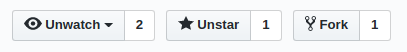

# Aprenda Git
Uma breve introdução aos conceitos básicos de Git, com uma linguagem simples e sem complicações.

Nesse repositório iremos apresenta-lo a alguns conceitos essenciais para utilizar o Git de um forma fácil e prática. Aqui você vai aprender a colaborar em projetos open source deixando sua Marca no processo!

[Para acessar a versão via GitHub Clasroom clique aqui!](via-classroom.md)

## Primeiros passos

### Iniciando o ambiente

Se você ainda não tem o git no seu computador, [instale-o aqui](https://git-scm.com/downloads)

Abra o _terminal_ ou _cmd_ (no windows faça INICIAR+R e digite cmd e aperte enter) e digite:

```
git config --global user.name "Seu Nome"
git config --global user.email "seu@email.com"
```



### Faça um Fork

Clique no botão "Fork" no canto superior direito da página, isto irá criar uma cópia deste repositório para a sua conta.

### Clone o seu fork


**Clone** o seu **Fork** para a sua máquina, este comando irá relizar o download do repositório, assim você poderá editar os arquivos localmente para depois enviá-los de volta para o GitHub.

Para clonar digite em seu terminal:

```
git clone https://github.com/seuUsuario/Aprenda-Git.git

```

### Crie um Branch

Um **branch** é uma ramificação do repositório inicial ele serve como uma forma de adicionar novidades sem modificar o código "Principal do projeto".

```markdown
git checkout -b nome-do-branch
```

Faça suas modificações adicionando seu perfil ou o script de hello world (_Sendo os dois melhor !_) utilizando um editor de texto a sua escolha.
### Crie seu arquivo

Crie um arquivo na pasta Alunos com seu perfil em um arquivo .md (o arquivo virá sem extenção padrão, por isso abra com o bloco de notas).

#### Arquivo de perfil

Crie um arquivo chamado `SeuNome.md` dentro da pasta Alunos. Você pode usar esse Arquivo como exemplo para criar seu perfil:

```markdown
# Seu Nome


## Curso

Seu curso na CESAR School ou seus cursos anteriores

## Interesses

- Algumas coisas que você gosta

## Projetos

- [Meu Projeto](Link do GitHub) Breve Descrição. Se não houver link basta contar o que você fez !

## Link do Perfil

[Seu Nome](Link do GitHub)
```

### Adicione os arquivos modificados a zona de stage

Nem sempre você irá querer "salvar" todos os arquivos que foram modificados naquele momento no git, apenas os arquivos adicionados à zona de **stage** são commitados, você pode especificar arquivo por arquivo a ser adicionado ou utilizar o símbolo: `.` para indicar todos os arquivos da pasta, assim:

``` markdown
git add .
```

### Faça um "Commit"

- Assim você irá salvar suas modificações no repositório local

- Dê um "Push" para que as modificações sejam enviadas para o servidor do GitHub!

```markdown
git commit -m 'Adicionando meu Perfil!'
git push origin nome-do-branch
```
### Volte para o site do GitHub

* E crie uma "Pull Request" do seu repositório "Fork" (Basta Clicar em "New Pull Request" de dentro do seu repositório "Fork")
* Agora só esperar que seu "Pull Request" seja adicionado nesse repositório!!!
* __Clique na estrela__ se você gostou do tutorial!

## Dicas para a contribuição

#### Script de "Hello, World" 

Crie um arquivo chamado `hello_world_seunome.xx` Dentro da pasta de Scripts! Aqui um exemplo:

```Javascript
// LANGUAGE: Javascript
// ENV: Node.js
// AUTHOR: Seu Nome
// GITHUB: https://github.com/SeuNome

console.log('Hello, World!');
```

Tente colocar alguns comentários ou link para referências, assim todo mundo aprende uma linguagem nova!

### Ou


#### Crie sua arte
Crie um arquivo chamado 'minha_arte_seunome.jpg(ou png)' Dentro da pasta Artes!


## Bem-Vindo ao CESAR School!!!
